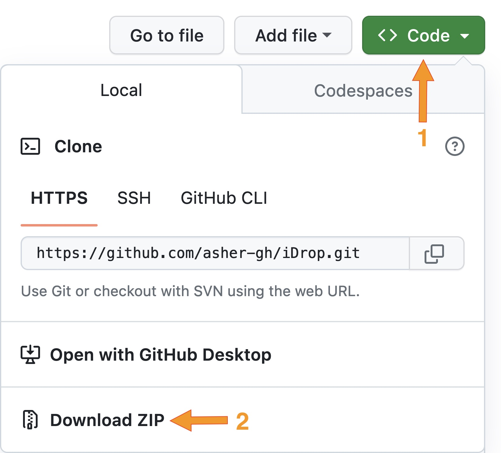

# About

Native cross-platform desktop application that assists with training deep learning models
and inferencing microfluidic droplet sizes from them. 

# Installation

```
Sadly, as this is a WIP, an installer is not available. 
However, you can follow the steps below to run the application on your system.
```

1. Clone this repo, or download as zip.



2. Make sure you have all the dependencies installed on your system.
   - [Rust](https://www.rust-lang.org/tools/install)
   - [Python](https://www.python.org/downloads/)

3. Open terminal (MacOS) or cmd (Windows) and navigate to current path.

4. Run the following command to build and run the application

```sh
cargo run -r
```

## Troubleshooting

Make sure the following are setup correctly for your system:

- Python (dynamic library for python version)
- Tensorflow2
- Rust toolchain
